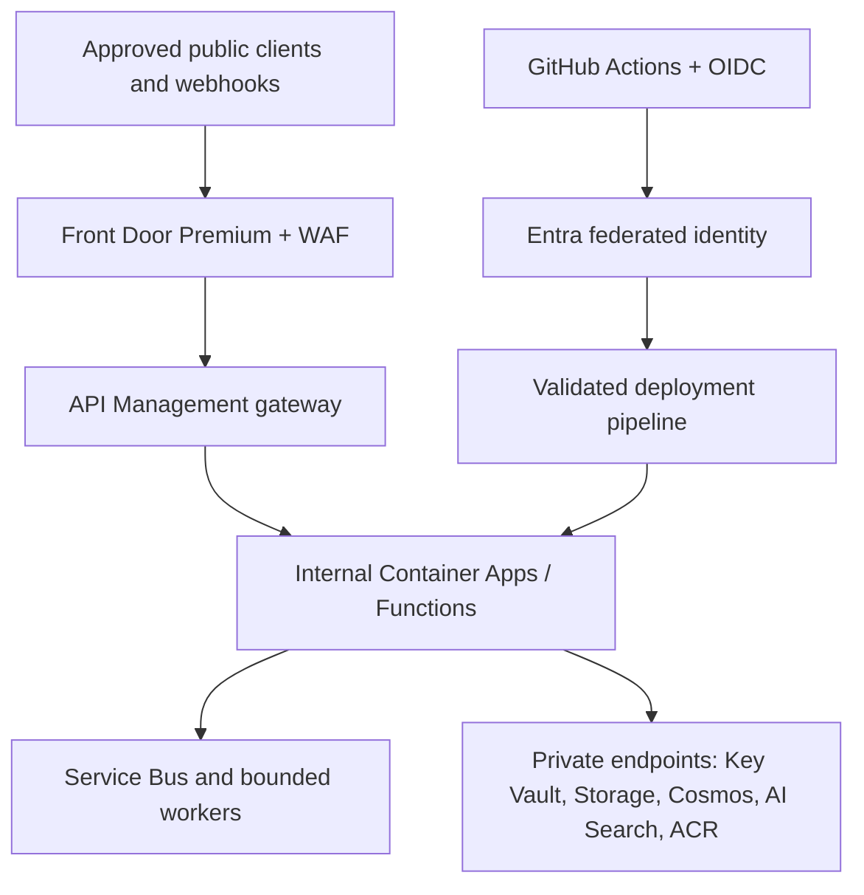

# HELIOS Network, Tunnel, and Delivery Pipeline Contract v1

Status: proposed governance baseline  
Authority: `M0nado/helios-platform` Issues #148 and #149  
Production enabled: no; Issue #162 remains the production blocker

Linked implementation tracks: #153 Azure foundation/OIDC, #154 Key Vault-backed broker, #155 Graph/Teams/SharePoint/OneDrive, #156 GitHub/Linear/Slack synchronization, #157 Hermes/AIHub registration, and #158 validation/rollback/compliance evidence.

## Purpose

This contract defines the allowed path from GitHub desired state to Azure runtime, the public and private network boundaries, the single development-only tunnel, and the evidence-producing deployment pipeline. It does not authorize resource creation, tenant consent, RBAC mutation, or production traffic.

## Target topology

GitHub owns the desired state. Azure accepts only an immutable reviewed commit and verified artifacts. No Azure runtime, GUI, plugin, tunnel, or connector may overwrite GitHub desired state.

The malformed mega-workflow proposed in PR #146 is not a deployable baseline. Pipeline jobs must reference real projects and artifacts, use valid YAML, prevent arbitrary-ref deployment, and prevent write-capable tokens from reaching pull-request-controlled build steps. The merged PR #147 collaboration model is retained, but its current integration-sync workflow is evidence generation only: it must generate the complete normalized envelope with a real JSON encoder, handle reopened pull requests, and exercise an actual OIDC exchange before it can claim connector automation.

## Environment isolation

Development, test, and production use separate identities, secrets, protected environments, data stores, and network policy. A development identity cannot be promoted by renaming it or reusing its credentials.

Canonical production resource names remain:

- resource group `rg-helios-prod`;
- Key Vault `kv-helios-core`;
- Cosmos DB account `cosmos-helios-memory`;
- artifact storage `stheliosartifacts`;
- Container Apps environment `cae-helios`;
- Log Analytics workspace `log-helios`.

Non-production resources use explicit environment suffixes and cannot share production private endpoints, managed identities, service connections, or writable data.

## Identity and authentication

1. GitHub Actions requests a short-lived OIDC token using `id-token: write` and exchanges it through a repository/environment/ref-bound Entra federated credential.
2. Each deployment stage uses a distinct least-privilege Azure identity scoped to the approved environment. Contributor or narrower custom roles are preferred; Owner is prohibited.
3. Container Apps, Functions, workers, APIM integrations, and Foundry agents use separate managed identities.
4. Microsoft 365 user actions use OAuth on-behalf-of and cannot exceed the signed-in user.
5. Local development uses interactive `az login`, `azd auth login`, and `gh auth login` in the active user context.
6. Static Azure client secrets, long-lived PATs, credentials in repository variables, and credentials passed through the tunnel are prohibited.
7. Webhook signing secrets and unavoidable provider keys are references resolved from Key Vault. Secret values never appear in pipeline output, deployment parameters, evidence, messages, prompts, or traces.

The federated credential must bind the canonical repository, protected GitHub environment, expected branch or tag, tenant, audience, and subject. Pull requests from forks never receive deployment credentials.

## Public ingress

Azure Front Door Premium and its WAF policy are the only production public ingress. Direct public access to APIM, Container Apps, Functions, storage, databases, or management endpoints is denied.

Front Door provides:

- TLS termination with current approved protocol/cipher policy;
- managed WAF rules plus HELIOS-specific body-size, rate, bot, and path restrictions;
- origin protection so only Front Door reaches the API gateway;
- health probing against a minimal unauthenticated liveness endpoint;
- request/correlation IDs and access logs with credential and personal-data redaction.

API Management is the application gateway and policy enforcement edge. It validates route, method, size, content type, schema, identity/token or webhook signature context, timestamp/replay window, rate limit, and environment. Unknown paths, tools, plugin IDs, and schema majors fail closed.

### Endpoint classes

| Endpoint | Exposure | Authentication and restrictions |
| --- | --- | --- |
| `/health/live` | Front Door health probes | No sensitive dependency detail; bounded response |
| `/health/ready` | Internal Container Apps probe only | Network-restricted and absent from the public APIM surface; dependency status redacted |
| `/webhooks/github`, `/linear`, `/slack` | Public through Front Door/APIM | Provider signature, timestamp/replay window, delivery ID, schema and size validation |
| `/webhooks/teams`, `/sharepoint`, `/foundry`, `/copilot` | Disabled until validation middleware is proven | Entra JWT or provider validation challenge; fail closed |
| `/api/v1/*` | Approved operator clients | Entra JWT, audience/scope/role checks, policy evaluation, rate limit |
| `/mcp/*` | Internal and disabled by default | Entra-authenticated, allowlisted tools only; no anonymous or production tunnel access |

Invalid authentication is rejected before payload processing and creates no downstream event. Duplicate delivery IDs create one target operation.

## Internal compute and messaging

- APIM forwards only to an internal Container Apps environment or private Functions endpoint.
- Ingress services validate and normalize envelopes, then persist them to Service Bus before connector work.
- Connector workers have one identity and egress policy per provider. A compromise of one connector cannot grant another connector's permissions.
- Workers are idempotent on event/command ID plus target and persist checkpoints before acknowledging a message.
- Transient failures use bounded exponential backoff with jitter. Permanent failures and exhausted retries enter a dead-letter queue with correlation and evidence references.
- Remote model/provider calls are treated as untrusted dependencies and cannot return an approval or expand the caller's capability.

## Private endpoints and egress

Key Vault, Storage/Data Lake, Cosmos DB, Azure AI Search, ACR, and other supported data-plane services use private endpoints and private DNS. Public network access is disabled after deployment validation proves the private path.

Egress passes through an environment-controlled NAT/firewall path with DNS and destination allowlists. Only registered provider endpoints are permitted. Connector plugins receive a policy-bound HTTP client rather than unrestricted network access. Direct outbound SMTP, arbitrary webhooks, package installation at runtime, and wildcard destinations are denied.

The OpenAI provider may use a registered public API endpoint through controlled egress when a private Azure path is not applicable. Authentication remains a Key Vault reference; the provider receives no Azure or Microsoft Graph credential.

## Development-only tunnel

Microsoft Dev Tunnels is the only approved local-development tunnel unless a later architecture decision replaces it. It is not a production ingress, service mesh, VPN, or emergency backdoor.

Rules:

- development environment only; production and shared test subscriptions reject tunnel origins;
- Entra-authenticated owner access, private visibility, short expiry, one developer, one registered local port;
- ephemeral tunnel identity and URL; no stable DNS, static client secret, anonymous access, or wildcard port forwarding;
- local service binds loopback; remote MCP remains read-only or disabled; all mutations remain dry-run;
- webhook routes still require genuine provider signatures, delivery IDs, replay protection, schema validation, and request limits;
- the tunnel may expose only explicitly registered development endpoints; Azure management, Key Vault, local filesystem, shell, debugger, database, and device services are forbidden;
- creation, use, and deletion are logged; the tunnel is deleted automatically at expiry or session completion;
- secrets, production data, personal data, and physical USB operations never traverse the tunnel.

A tunnel URL is never committed to source, stored as a permanent provider callback, or accepted in production configuration.

## Delivery pipeline

The canonical GitHub Actions pipeline is an ordered, fail-closed promotion:

1. **Resolve** — pin repository, ref, commit, environment, manifests, dependency graph, and source provenance.
2. **Validate** — schema lint, formatting, compiler/static analysis, unit and contract tests, secret/license/dependency scans.
3. **Build** — reproducible .NET, Windows GUI, F#, optional C++20, Python, and container artifacts from pinned dependencies.
4. **Assure** — integration/negative tests, CodeQL or equivalent, SBOM generation, vulnerability policy, hashes, signatures, and OIDC-backed attestations.
5. **Plan** — `azd provision --preview`, Bicep lint/validate, and Azure `what-if`; fail on unreviewed deletion, replacement, public exposure, broad RBAC, or secret material.
6. **Deploy development** — use the development federated identity and immutable digests; never rebuild between stages.
7. **Verify development** — health, auth denial, signature/replay, broker persistence, idempotency, DLQ, telemetry, evidence, and rollback smoke tests.
8. **Request promotion** — create an evidence-bound protected-environment approval for the exact commit, artifacts, plan digest, environment, and rollback point.
9. **Deploy approved environment** — exchange a fresh environment-bound OIDC token and deploy the same verified digests.
10. **Verify and publish evidence** — record deployment result, runtime versions, tests, SBOMs, attestations, what-if, approval, telemetry links, and rollback readiness.
11. **Rollback on gate failure** — stop promotion, restore the last verified immutable artifacts/configuration, validate, and publish a correlated rollback result.

No pipeline step can approve itself. Production jobs require a protected environment and remain disabled until Issue #162 is closed.

## Service-connection rules

- GitHub OIDC and Entra workload identity federation are the primary CI-to-Azure connection.
- Azure Pipelines, if used as the regulated bridge, uses its own workload-identity-federated Azure Resource Manager service connection and consumes the same immutable commit and artifact digests.
- GitHub and Azure Pipelines cannot both publish production independently. The canonical GitHub manifest names the authoritative promotion run and any Azure DevOps approval/evidence handoff.
- Service connections are environment-specific, least privilege, regularly reviewed, and prohibited from containing client secrets.
- Azure DevOps is a bridged Boards/Pipelines/Artifacts/approval surface, never a competing source repository or desired-state authority.

## Observability, evidence, and recovery

- Front Door, WAF, APIM, Container Apps/Functions, Service Bus, workers, private DNS, firewall/egress, Key Vault access, and deployment pipelines send redacted telemetry to Application Insights and Log Analytics.
- W3C trace context and the HELIOS correlation ID propagate through ingress, broker, connector, evidence, and notification paths.
- Alerts distinguish authentication attacks, validation failures, throttling, provider outage, queue age, DLQ growth, policy denial, deployment regression, and evidence failure.
- Logs never include authorization headers, cookies, tokens, signing secrets, raw prompts, secret-bearing parameters, or unredacted personal data.
- Recovery evidence identifies the last known-good commit and artifact digests, configuration version, schema compatibility, data migration status, recovery owner, target RTO/RPO, and validation result.

## Acceptance gates

Before production can be enabled, evidence must prove:

- repository rules and PR #170 are green;
- federated credentials reject the wrong repository, ref, environment, tenant, and fork;
- no static client secret is required by GitHub or Azure Pipelines;
- Front Door is the only public origin path and WAF/APIM negative tests pass;
- private endpoint and private DNS paths work while public data-plane access is disabled;
- connector egress cannot reach unregistered destinations;
- tunnel traffic is impossible in production and expires cleanly in development;
- duplicate, replayed, malformed, oversized, unsigned, and unauthorized requests create no downstream mutation;
- Bicep `what-if`, protected approval, deployment evidence, monitoring, and executable rollback pass;
- Issue #162 is explicitly closed.

No resource deployment or identity/RBAC mutation is authorized by this document.
