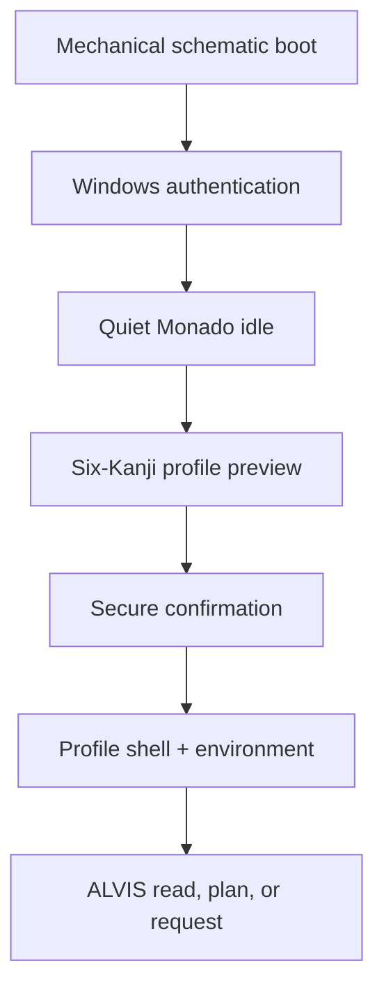
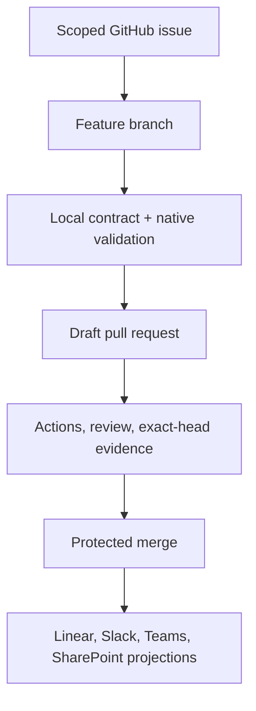

# Monadoblade Delivery Fabric v2

Status: implementation contract for [GitHub issue #207](https://github.com/M0nado/helios-platform/issues/207). This change defines and validates architecture; it does not deploy Azure resources, alter Windows authentication, replace Explorer, write boot configuration, partition a disk, or activate tenant permissions.

## North star

Monadoblade is one governed Windows experience in which six permanent identities reshape the shell, environment, tools, sound, lighting, and resource intent while sharing one policy model, one ALVIS boundary, and one evidence trail.

`M0nado/helios-platform` is the code and release authority. The GUI framework, cinematic engine, AIHub, and USB Wizard remain independent products connected by versioned packages rather than copied implementations.

## Preserved decisions

- The permanent wheel is closed at six identities: Core `核`, Developer `創`, Studio `響`, Gamer `迅`, AI/Server `智`, and offline Sysadmin `統`.
- Personal and SysOps are capability overlays. They are useful behavior bundles, not additional login sectors.
- Airgap, Recovery, and Quarantine are governed workflows. They never appear as identities.
- The Monado is upright and centered. One selector is registered to its physical aperture; a second decorative wheel is forbidden.
- The ether blade body remains cyan-white. A focused identity contributes a narrow colored filament, aura, particles, sound, and Chroma response.
- Each Kanji has a permanent color, phase rhythm, growth behavior, and Wyvern cue. Color is not the only signal.
- Idle collapses the orbital holograms to a quiet aperture breath. Boot is mechanical and schematic rather than permanently holographic.
- ALVIS is a separate command surface. It can search, fetch, plan, or submit an approval request; it is not a direct executor.
- Sysadmin is hidden, local, offline, two-factor, and unavailable to AI or remote activation.
- Windows authentication, Explorer replacement, boot configuration, disk changes, Azure deployment, and tenant authorization remain separate reviewed executors.

## Layered architecture

| Layer | Purpose | Major components | Interfaces | Constraints |
|---|---|---|---|---|
| Experience | What the operator sees, hears, and touches | WinUI ShellKit, Monado wheel, taskbar/flyouts, profile surfaces, ALVIS overlay, USB preview | Identity contract, energy bus, accessibility state | Windows-native actions stay recognizable; safe-neutral fallback |
| Orchestration | Coordinate state, policy, and evidence | Profile broker, ALVIS policy, USB request broker, normalized events, GitHub workflow | C# contracts, JSON manifests, MCP tool classes | No conversational or connector bypass of approvals |
| Core engines | Render, score, and route bounded work | C++ environment planner, HLSL particles, AIHub adapters, Hermes routing, XCore evaluation | Portable C++ header, D3D adapter, evaluation records | Fixed budgets; prototypes are not production executors |
| Platform | Shared identity, storage, packages, and telemetry | HELIOS contracts, Key Vault/OIDC policy, event schema, package ownership | NuGet/contracts, signed packages, workload identity | GitHub is engineering truth; secrets never enter contracts |
| Substrate | Windows, GPU, disks, USB, Azure, devices | WinUI 3, Windows App SDK, Direct3D, optional Razer SDK, protected Azure environments | SwapChainPanel, device broker, Bicep what-if | Physical/cloud mutation requires separate exact-target approval |

## Permanent identity contract

| Identity | Kanji | Color | Shell grammar | Environment | Primary intent |
|---|---:|---|---|---|---|
| Core | 核 | `#53F6FF` | Harmony orbit | Balanced titan-scale horizon | Quiet, balanced, responsive daily use |
| Developer | 創 | `#2F86FF` | Build graph and terminal | Cool grid storm | Builds, native toolchains, containers, tests |
| Studio | 響 | `#D64DFF` | Spatial waveform console | Resonance field | Low-jitter audio, plugins, media, rendering |
| Gamer | 迅 | `#62FF4A` | Minimal launch HUD | Velocity plains | Frame time, input latency, GPU priority |
| AI/Server | 智 | `#7A6BFF` | Topology, agents, and queues | Service-mesh night | Models, workers, memory, service health |
| Sysadmin | 統 | `#FFB000` | Quiet mechanical ledger | Sealed local vault | Integrity, recovery, audit, exact local control |

The machine-readable authority is [`config/profiles/monadoblade-profiles.v2.json`](../../config/profiles/monadoblade-profiles.v2.json). Consumers reject unknown contract versions rather than inventing new sectors.

The synchronized Wyvern, Chroma, and particle limits live in [`config/experience/monadoblade-effects.v1.json`](../../config/experience/monadoblade-effects.v1.json). The evaluation-only AIHub candidates derived from the supplied registry material live in [`config/aihub/monadoblade-engine-registry.v1.json`](../../config/aihub/monadoblade-engine-registry.v1.json); training and autonomous promotion are disabled.

## Migration from v1

The existing seven-profile model remains intact as a supported migration input. No history is rewritten.

| Legacy v1 profile | v2 destination | Reason |
|---|---|---|
| `developer` | Developer identity | Direct identity match |
| `sysadmin` | Sysadmin identity | Direct identity match with stricter offline boundary |
| `sysops` | SysOps overlay on Developer or AI/Server | Operations capability should not be a separate person/identity |
| `gamer` | Gamer identity | Direct identity match |
| `studio` | Studio identity | Direct identity match |
| `personal` | Personal overlay on Core or Studio | Quiet/privacy behavior is contextual capability |
| `server-background` | AI/Server identity and noninteractive services | One visible identity owns server/AI intent; services stay service identities |
| none | Core identity | New default and coherent daily center |

## Module contracts

| Module | Owns | Inputs | Outputs | Failure behavior | Completion test |
|---|---|---|---|---|---|
| `HELIOS.Monadoblade.Contracts` | Identity, overlay, workflow, ALVIS, event types | Versioned JSON and C# | Frozen validated catalogs | Reject unknown/malformed contract | C# build and contract validator |
| `HELIOS.Monadoblade.ShellKit` | Wheel, taskbar, flyouts, account views, ALVIS UI | Identity and energy state | Accessible WinUI surfaces | Windows-native safe-neutral shell | WinUI tests on Windows runner |
| `HELIOS.Monadoblade.Renderer` | Monado model, aperture, living scene | Environment signals and energy state | D3D frames and frame telemetry | Static background | Native smoke, DXC, frame-budget test |
| `HELIOS.Chroma.Adapter` | Vendor lighting translation | Rate-limited energy frames | Device lighting frames | Screen preview only | SDK integration test on opted-in hardware |
| `HELIOS.Wyvern.Audio` | Procedural and sampled cues | State transitions, quiet hours | Nonblocking audio events | Silent | Cue contract and latency test |
| `HELIOS.ALVIS.Surface` | Search/fetch/plan/request UX | Approved MCP catalog and local state | Read results, plans, approval requests | Read-only local status | Tool-prefix and approval validation |
| `HELIOS.USB.DeviceBroker.Contracts` | Inventory and proposed storage plan | Exact device identity and template | What-if, rollback, evidence packet | Inventory only | No selected disk; apply remains false |

## Primary experience flow



### Boot

Two indexed rails lock, six field coils charge, twin motors counter-rotate, four iris shutters retract, the Core Kanji resolves, and the cyan-white ether blade grows upward as the loading column. Boot does not show persistent profile holograms and cannot write BCD, UEFI, WinRE, or disk state.

### Interactive identity selection

Pointer, keyboard, controller, or touch wakes one aperture-registered wheel. A focused Kanji grows and sounds once. Its permanent color enters the aperture, travels up the fully extended cyan-white blade as a thin filament, and drives matching particles and Chroma. Preview is reversible; only explicit secure confirmation commits.

### Shell

The Monado taskbar control opens the identity/Start wheel. ALVIS has its own control. Network, volume, power, notifications, and ordinary launch actions remain Windows-native components whose material, density, motion, and environment adapt by identity.

### USB Wizard

The USB Wizard consumes ShellKit and Renderer only as presentation packages. The platform supplies a plan-only device-broker contract. Inventory produces exact model, serial, unique ID, capacity, proposed layout, what-if, rollback, backup evidence, BitLocker recovery evidence, and an operator receipt. No disk is preselected; there is no apply call in the GUI or ALVIS.

## Living environment and performance

The environment is a faux-3D composition, not a hidden game world:

- four parallax horizon cards establish scale and pointer-relative depth;
- instanced grass ribbons share geometry and wind fields;
- a fixed particle pool recycles in place through one HLSL compute pass and one instanced draw;
- low-resolution fog is composited behind interactive UI;
- local clock drives day/night without a network dependency;
- live weather is optional, consented, cached for 30 minutes, and falls back to a deterministic seasonal simulation;
- minimized or occluded windows spend zero particle or grass budget;
- reduced motion, remote sessions, battery, thermals, memory, GPU load, and frame time lower the tier automatically.

| Tier | Particles | Horizon cards | Grass instances | Update rate | Fog scale |
|---|---:|---:|---:|---:|---:|
| Suspended | 0 | 0 | 0 | 0 | 0 |
| Minimal | 384 | 2 | 96 | 15 Hz | 0.25 |
| Balanced | 3,072 | 4 | 1,024 | 30 Hz | 0.50 |
| Cinematic | 8,192 | 4 | 4,096 | 60 Hz | 0.67 |

The portable planner is [`monadoblade_environment_renderer.hpp`](../../src/native/HELIOS.Native.Performance/include/helios/monadoblade_environment_renderer.hpp); the renderer host remains a Windows/Direct3D integration task.

## ALVIS and agent boundary

| Prefix | Effect | Approval |
|---|---|---|
| `search_` | Read-only discovery | None |
| `fetch_` | Read-only retrieval | None |
| `plan_` | Deterministic plan/evidence generation | None; cannot execute |
| `request_` | Create a pending approval request | Human approval required |

There are no `execute_`, `apply_`, `deploy_`, `format_`, or direct shell tools. Sysadmin permits only approved local providers and read/plan effects with network access denied.

Hermes may route bounded tasks and emit normalized events. XCore may score, compare, prune derived learning state, and flag regressions. Neither can promote models, change policies, write repositories, deploy Azure, message external systems, or mutate devices without the owning reviewed workflow.

## GitHub and collaboration workflow



- GitHub owns code, PRs, checks, review, release evidence, and the exact merged SHA.
- Linear tracks delivery state; JOH-44 is the current lane.
- Slack carries fast engineering notification and the delivery canvas.
- Teams carries enterprise handoff only after exact recipient/channel resolution; it cannot trigger execution.
- SharePoint holds governed architecture/runbook and release evidence.
- Azure DevOps remains discovery/read-only until an approved service connection and executor exist.
- Adobe holds visual assets and component boards, never code authority.
- All projected records carry the GitHub issue/PR, correlation ID, and exact head/merge SHA. They cannot trigger execution.

## Uploaded source intake

The sixteen supplied files are inventoried by SHA-256 in [`monadoblade-delivery-fabric.v1.json`](../../config/integrations/monadoblade-delivery-fabric.v1.json).

- `ml_registry.py` and `deep_engine_fabric.py` contribute engine families, backend ownership, and plan-only evaluation ideas.
- The Hermes/XCore loops contribute bounded-cycle, score, reflection, and local-artifact concepts.
- `aihub_control_server.py` is quarantined as a prototype because it defaults to `0.0.0.0` and exposes unauthenticated task/training POST routes.
- `ai.py` stays reference-only until every mutation routes through ALVIS approval requests.
- `build_super_outputs.py` depends on absent modules and is reference-only.
- Logs and reboot markers are generated machine evidence and remain outside Git.
- Every `.crdownload` is incomplete. Azure, VNet/DNS, Key Vault, M365, and WinRE ideas route to existing protected Bicep, tenant-admin, or USB plan lanes instead of being imported as executable PowerShell.

## Dependency-ordered delivery

| Milestone | System state unlocked | Modules delivered | Proof of completion | Main risk |
|---|---|---|---|---|
| Foundation | One canonical identity/policy truth | v2 JSON, C# types, validator, migration map | CI validates six identities and safety invariants | Legacy consumers assume seven identities |
| Vertical slice | Core-to-shell-to-renderer demo | ShellKit adapter, C++ planner, static/faux-3D scene | Windows runner renders Core with safe fallback | WinUI/D3D interop timing |
| Integrated core | Six distinct identities and ALVIS | Wheel, taskbar, layouts, energy bus, read/plan/request tools | Accessibility, state, audio, Chroma, and failure-isolation tests | Effects drift between packages |
| Hardened release | Safe operator and USB preview | Signed packages, broker inventory, evidence receipts | Exact-device dry run; zero apply surface | Physical-device variance |
| Expansion | Optional weather, devices, agents attach cleanly | Live weather adapter, vendor SDKs, Foundry evaluations | Consent, budget, policy, and rollback evidence | Optional integrations become accidental dependencies |

## Decision ledger

| Decision | State | Reason | Downstream impact | Revisit trigger |
|---|---|---|---|---|
| Six permanent identities | Locked | Repeatedly accepted interaction core | All consumers validate exact set | Explicit product decision and v3 migration |
| Personal/SysOps as overlays | Revised | Preserve behavior without wheel drift | v1 migration and policy adapter required | Overlay cannot express a proven security boundary |
| Recovery/Quarantine as workflows | Locked | They are conditions/actions, not identities | USB and Sysadmin UI only | None without threat-model review |
| Post-auth shell | Locked | Avoid unsafe credential-provider replacement | Matrix terminal is visual/delegated only | Separate signed Windows security project |
| C++ faux-3D renderer | Locked for prototype | High visual return at bounded cost | WinUI adapter and DXC validation needed | Profiling shows Windows Composition is sufficient |
| Raw uploaded prototypes excluded | Locked for this PR | Missing auth, modules, completeness, or safety gates | Concepts absorbed through contracts | Separate issue hardens one prototype with tests |
| Live weather optional | Proposed integration | Adds real-world motion without shell dependency | Consent, cache, and synthetic fallback | Privacy or reliability review rejects location use |

## Build now, experiment next, preserve for later

### Build now

- Validate v2 identity, shell, environment, storage, and integration contracts.
- Compile C# contracts and portable C++ scene planner.
- Land the migration map and repository/package ownership.
- Use the GUI framework and USB Wizard issues as the next extraction lanes.

### Experiment next

- Bind the renderer to WinUI `SwapChainPanel` and profile the real D3D frame budget.
- Produce six profile component boards and motion/sound tokens in Adobe.
- Bind Chroma and Wyvern adapters behind rate limits and quiet-hours policy.
- Expose ALVIS search/fetch/plan/request tools through the existing governed MCP runtime.

### Preserve for later

- Signed Explorer/taskbar replacement, custom Credential Provider, WinRE deployment, physical partition executor, tenant-wide Graph policy, and Azure deployment.
- These require separate repositories or protected executors, threat models, rollback proofs, and explicit approvals. They are not quietly activated by this architecture.

## Validation and rollback

Run:

```bash
python3 scripts/validation/validate_monadoblade_delivery_fabric.py
c++ -std=c++20 -Wall -Wextra -Werror -pedantic \
  -Isrc/native/HELIOS.Native.Performance/include \
  tests/native/monadoblade_environment_smoke.cpp \
  -o /tmp/monadoblade_environment_smoke
/tmp/monadoblade_environment_smoke
```

On a full toolchain, also run the CMake/CTest graph and build `HELIOS.Platform.Contracts`. Rollback is additive: v1 contracts remain untouched, so consumers can ignore v2 until they explicitly adopt it. Reverting the v2 commit removes no v1 identity, partition, software, or runtime configuration.
