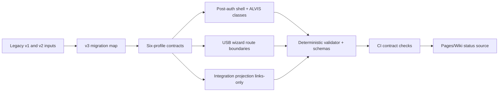

# Monadoblade six-profile delivery fabric v3

## Intent

This document defines the authoritative issue-207 delivery fabric for Monadoblade in `M0nado/helios-platform`.  
It introduces a versioned six-profile model while preserving legacy v1/v2 artifacts as historical inputs.

## Authoritative v3 contract set

- `config/monado-enterprise/v3/index.json`
- `config/monado-enterprise/v3/profiles.contract.v3.json`
- `config/monado-enterprise/v3/experience.contract.v3.json`
- `config/monado-enterprise/v3/storage.contract.v3.json`
- `config/monado-enterprise/v3/integration-projection.contract.v3.json`
- `config/monado-enterprise/v3/repository-map.contract.v3.json`
- `config/monado-enterprise/v3/libraries.contract.v3.json`
- `config/monado-enterprise/v3/migration-map.contract.v3.json`
- `config/monado-enterprise/v3/profile-manifests/*.xml`
- `schemas/monado-enterprise/v3/*.schema.json`
- `schemas/monado-enterprise/v3/profile-manifest.v3.xsd`

## Six-profile model

Permanent profiles:

1. Core `核`
2. Developer `創`
3. Studio `響`
4. Gamer `迅`
5. AI/Server `智`
6. SysAdmin (local/offline) `統`

Recovery and Quarantine are SysAdmin workflows, not profiles.

## Legacy preservation and migration

- v1 and v2 artifacts remain intact.
- Migration lineage is documented in `config/monado-enterprise/v3/migration-map.contract.v3.json`.
- No historical profile files are rewritten or deleted.

## Safe shell boundary

The Monadoblade shell is post-auth presentation only:

`safe-boot -> identity-verified -> wheel-select -> shell-active`

Failures route to `safe-neutral-blocked`.  
Windows credential validation is never replaced by the custom shell.

## ALVIS contract boundary

ALVIS remains non-administrative and non-executing:

- `search_*` and `fetch_*` are read-only.
- `plan_*` is proposal-only.
- `request_*` is pending-approval only.
- Executor/apply tool classes are disallowed.

## USB Wizard and storage-plan boundary

- Inventory route is dry-run/read-only.
- Storage-plan requests are device-specific and proposal-only.
- Runtime physical USB or disk apply paths are forbidden.
- Recovery/Quarantine ownership remains SysAdmin.

## Integration projection contract

Only approved PR/evidence links project to:

- Linear
- Slack
- Teams
- SharePoint
- Azure DevOps

Projection is links-only and cannot trigger execution in destination systems.

## Governance gates

- GUI and USB extraction remain gated by issue `#149`.
- Runner topology evidence remains gated by issue `#194` and PR `#196`.
- Deployment evidence remains gated by issue `#162`.

## Visual map

