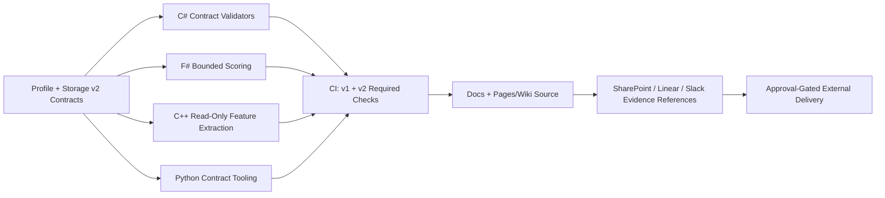

# Monado enterprise experience fabric v2

## Intent

This document defines the authoritative v2 integration fabric for Monado enterprise experience in `M0nado/helios-platform`. It keeps v1 contracts as historical input and promotes v2 as the execution baseline for contract validation, profile semantics, storage intent, and cross-system synchronization.

## Ownership boundaries

| Surface | Authority | Notes |
| --- | --- | --- |
| Product contracts, routing, policy, CI | `M0nado/helios-platform` | Canonical source of truth |
| Cross-repository governance and bootstrap | `Heli0s-Dynamics/adaptive-multibrain-bootstrap` | Policy/control plane, not product duplication |
| Hermes/XCore fleet runtime | `Yolkster64/hermes-fleet-platforms` | Companion fleet integration only |
| Dedicated GUI implementation | Issue #172 / #195 track | Linked into contracts, not duplicated |
| Dedicated USB Wizard implementation | Issue #171 track | Linked into contracts, not duplicated |

## v2 contract set

Authoritative machine-readable artifacts:

- `config/monado-enterprise/v2/index.json`
- `config/monado-enterprise/v2/storage.contract.v2.json`
- `config/monado-enterprise/v2/profiles.contract.v2.json`
- `config/monado-enterprise/v2/experience.contract.v2.json`
- `config/monado-enterprise/v2/synchronization.contract.v2.json`
- `config/monado-enterprise/v2/repository-map.contract.v2.json`
- `config/monado-enterprise/v2/profile-manifests/*.xml`
- `schemas/monado-enterprise/v2/*.schema.json`
- `schemas/monado-enterprise/v2/profile-manifest.v2.xsd`

## Storage model (v2)

v2 explicitly separates physical and hosted virtual storage:

1. Disk 0 keeps Windows/Core + Recovery + physical `X: CORE_CROSS`.
2. Disk 1 provides a single Domains host volume with ACL-separated domain trees.
3. `D:` is a dynamic ReFS Dev Drive VHDX hosted on Disk 1.
4. `V:` is a dynamic BitLocker Vault VHDX hosted on Disk 1 and **never auto-mounted**.
5. Exact size lock remains unresolved and apply remains blocked by default.

## Permanent profile model (v2)

Permanent profiles:

- Core
- Developer
- Gamer
- Studio
- Personal
- SysOps
- AI/Server
- SysAdmin

Recovery and Quarantine are states, and Airgap is an overlay.

## ALVIS and experience boundaries

- ALVIS is one reactive assistant instance.
- ALVIS is not an administrator and cannot perform autonomous apply.
- External writes stay approval-gated and correlation/evidence-linked.
- Profile contracts define semantic UI, theme, Chroma/Wyvern, service/process budgets, software links, storage roots, networking policy, telemetry policy, and tool budgets.

## Synchronization contract

v2 synchronization is normalized, idempotent, and proposal-only across:

- GitHub
- Linear
- Slack
- SharePoint
- Azure DevOps (read-only mirror until approved write identity exists)
- Adobe design evidence references (no direct write mode)

Idempotency keys use normalized length-prefixed SHA-256 contract inputs.

## CODEOWNERS-ready path map

Machine-readable path ownership is declared in:

- `config/monado-enterprise/v2/repository-map.contract.v2.json`

Key ownership groups:

- `config/monado-enterprise/v2/**` (contracts and architecture)
- `schemas/monado-enterprise/v2/**` (schema governance)
- `src/core/HELIOS.Platform.Contracts/**` (typed C# contracts)
- `src/analytics/HELIOS.Analytics.FSharp/**` (bounded F# scoring)
- `src/native/HELIOS.Native.Performance/**` (C++ read-only extraction)

## Visual architecture map

## Project status sources

- GitHub issue: `https://github.com/M0nado/helios-platform/issues/206`
- Linear issue: `https://linear.app/641974/issue/JOH-45/monado-enterprise-experience-fabric-v2`
- SharePoint evidence record: `HELIOS_MONADO_ENTERPRISE_EXPERIENCE_V2.md`
- Slack policy: single concise checkpoint after branch publication
