# One-button automation guide

This guide explains how a HELIOS work item can move from an issue to a verified
deployment without turning automation into an unreviewed administrator. The first
sections are intentionally written for a junior developer. Operators and platform
owners can jump to [implementation and governance references](#implementation-and-governance-references).

> **The safe mental model:** **Start and auto-setup** prepares and proposes work.
> It does not grant an agent permission, weaken branch protection, reveal secrets,
> or approve a deployment. A tag, score, or successful automation step is evidence,
> never authority.

## The two-minute start

Before starting, make sure you have a scoped GitHub issue, repository access, and a
clean checkout on a feature branch. Do not paste credentials into the issue or app.

### `Start and auto-setup` walkthrough

1. **Open the issue (0:00–0:20).** Confirm the goal and acceptance criteria. Select
   **Start and auto-setup**, then choose the lowest deployment level that can prove
   the change. For a first run, use **L1 (local validation)** or **L2 (branch CI)**.
2. **Review the preview (0:20–0:45).** Check the repository, branch name, proposed
   tags, assigned Hermes fleet, requested tools, and test plan. Red text means a
   blocking policy or missing prerequisite. Nothing privileged should run here.
3. **Start the quest (0:45–1:10).** The app creates a correlated quest and worktree,
   reads approved project instructions, and queues bounded tasks. Watch the **Party**
   screen until every participant is healthy; a waiting-for-approval state is normal.
4. **Inspect the evidence (1:10–1:35).** On **Quest**, open the diff, test results,
   and evidence links. On **Knowledge**, verify that suggestions cite current source
   or approved records. Never approve an unexplained binary, generated secret, or
   unrelated change.
5. **Publish for review (1:35–2:00).** Choose **Prepare PR**. Automation may make a
   scoped commit, push its feature branch, and open or update a draft PR when policy
   permits. Read the PR and request human review. Moving beyond the configured gate,
   merging a protected change, or deploying requires the controls shown by the app.

If any preview target is wrong, choose **Pause**, correct the issue or configuration,
and rerun the preview. Do not “fix” a blocked run by broadening permissions.

## Issue-to-deployment pipeline

```mermaid
flowchart LR
    A[Scoped GitHub issue] --> B[Start and auto-setup]
    B --> C[Preview: repository, tags, level, plan]
    C --> D[Feature branch and correlated quest]
    D --> E[Hermes routes bounded tasks]
    E --> F[Agents implement and test]
    F --> G[XCore9 evaluates policy, quality, and evidence]
    G -->|fail or uncertain| H[Pause, repair, or request approval]
    H --> F
    G -->|gates satisfied| I[Scoped commit and branch push]
    I --> J[Draft or review-ready pull request]
    J --> K[Required CI, review, and security checks]
    K -->|not approved| H
    K -->|approved for level| L[Limited merge through branch policy]
    L --> M[Staged deployment and health checks]
    M -->|explicit production approval| N[Production deployment]
    M -->|failed health check| O[Automatic halt and rollback request]
    N --> P[Evidence, telemetry, XP, and fleet score]
    O --> P
```



Every transition keeps the issue/PR, commit, correlation ID, actor, environment,
and evidence links together. A failure loops back to review; it never silently skips
a gate.

## Deployment levels L0–L8

Levels describe **how far a quest may progress**, not how trusted an agent is. A run
may advance only to its selected ceiling and can be stopped earlier by repository,
environment, or Guardian policy. Higher levels inherit all lower-level checks.

| Level | Name | Maximum automated scope | Gate to continue |
|---|---|---|---|
| **L0** | Observe | Read allowlisted metadata, inventory, and health; make no writes. | None for approved public metadata; audited access for private data. |
| **L1** | Local validate | Create ephemeral local plans, diffs, builds, tests, and dry runs. | Developer reviews the preview and local evidence. |
| **L2** | Branch CI | Create/update a feature branch and run CI; never write to the default branch. | Repository write policy, clean secret scan, and scoped issue. |
| **L3** | Pull request | Make scoped commits, push the automation branch, and open/update a draft PR. | Required checks plus human review before protected merge. |
| **L4** | Limited merge | Merge an allowlisted, low-risk PR only through normal branch protection. | Explicit approval when policy requires it; green checks and rollback plan always. |
| **L5** | Development deploy | Deploy a reviewed artifact to an isolated development environment. | Environment policy, workload identity, health checks, and recorded rollback point. |
| **L6** | Test/staging deploy | Promote the same immutable artifact to test or staging and run integration/security tests. | Protected-environment approval and complete evidence bundle. |
| **L7** | Production canary | Release an approved artifact to a bounded ring, region, or percentage and watch SLOs. | Explicit, unexpired production approval bound to commit, artifact, target, and rollback. |
| **L8** | Production rollout | Expand a healthy canary using progressive delivery; halt on guardrail breach. | A separate approved rollout decision, live monitoring, and verified recovery readiness. |

Selecting L8 does **not** pre-approve L4–L8. It declares an intended ceiling; each
protected boundary still evaluates its own approval and evidence.

## Tags route work; they do not authorize it

Automatic tags are normalized hints derived from issue fields, changed paths,
language manifests, risk rules, and requested environment. Examples include
`area:aihub`, `lang:csharp`, `risk:security`, `deploy:staging`, and `needs:xcore`.
They can:

- select an allowlisted Hermes queue or specialist profile;
- add relevant checks, reviewers, dashboards, and knowledge collections;
- set a conservative deployment-level ceiling or require additional evidence; and
- correlate a GitHub issue with Linear and notification projections.

They cannot grant repository, Azure, tenant, Graph, host-administrator, merge, or
deployment permission. Identity and authorization are evaluated independently at
execution time. A user-editable label cannot satisfy approval, and Slack/Teams
messages never trigger execution. If tags conflict, routing chooses the most
restrictive policy and asks for review.

## Automatic Git operations and limited merges

Automation follows the same reviewable path as a developer:

1. It creates a feature branch tied to the issue and correlation ID.
2. It stages only in-scope files, scans for secrets/generated evidence, and records
   test commands. Commits identify the automation actor; they do not impersonate a
   reviewer.
3. It pushes only to its allowed branch with a short-lived token or workload identity.
   Direct pushes to a protected default/release branch are prohibited.
4. It opens or updates a **draft PR**, links evidence, and waits for checks/review.
   Repeated runs update the same correlated PR rather than opening duplicates.
5. A **limited merge** can occur only for an allowlisted change class, through the
   configured merge queue or branch rules, with green required checks, required
   human approval, no unresolved review, and a rollback plan. The PR event route
   itself can notify systems but is explicitly unable to merge or publish a release.

No automation may bypass branch protection, approve its own work, force-push over
human commits, or treat an XP/fleet score as approval.

## Hermes fleets and XCore9

**Hermes** is the dispatcher, not the approver. It breaks a quest into bounded tasks,
routes them to language/domain specialists, limits concurrency and retries, preserves
correlation IDs, and summarizes results. A fleet might include C# UI/service, C++
performance, F# analytics, Python AIHub, documentation, test, or security specialists.
Workers receive only the tools and context their task needs.

**XCore9** is the nine-role evaluation party. Deployments should configure the exact
workers, but the UI groups their responsibilities consistently:

1. **Scope** — issue linkage, ownership, and unrelated-change detection.
2. **Contract** — schemas, normalized events, compatibility, and correlation.
3. **Build** — reproducible compilation, packaging, and artifact identity.
4. **Test** — unit, integration, system, and regression evidence.
5. **Security** — secrets, dependencies, permissions, and unsafe actions.
6. **Performance** — benchmark deltas, budgets, and capacity signals.
7. **Quality** — maintainability, review findings, and documentation.
8. **Reliability** — health gates, observability, rollback, and recovery readiness.
9. **Guardian** — policy aggregation; blocks unsafe or insufficiently approved work.

XCore9 produces findings and policy verdicts. It can reject, quarantine, prune
untrusted derived knowledge, or request a human decision; it cannot manufacture the
human approval that a protected action requires.

## Agent XP and fleet scores

Scores are explainable operational feedback, not access control. Only completed,
correlated quests with retained evidence are scored; cancelled or unverifiable work
earns no positive XP.

For each quest, normalize these values to `0..1`:

- `Q`: required quality/test/contract checks passed;
- `S`: security and policy compliance;
- `R`: reliability, rollback, and evidence completeness;
- `E`: efficiency against the quest's time/cost budget; and
- `H`: human-review outcome (accepted findings and no justified rework).

The displayed quest result is:

```text
quest_score = 100 × (0.30Q + 0.25S + 0.20R + 0.10E + 0.15H)
agent_xp   = round(complexity × quest_score / 100 × evidence_factor)
```

`complexity` is a policy-owned point value fixed when the quest starts;
`evidence_factor` is `1.0` for complete evidence, reduced for partial/late evidence,
and `0` for missing or invalid evidence. Policy/security violations add no XP and may
trigger review; scores are never reduced merely because an agent safely paused.

The fleet score is a recency-weighted mean, with reliability penalties:

```text
fleet_score = clamp(0, 100,
  weighted_mean(last 30 eligible quest_scores, weight = evidence_factor × recency)
  - 10 × escaped_regressions
  - 5  × unsafe_retry_or_rollback_failures)
```

The screen must show the formula version, sample window, inputs, exclusions, and
penalties. Compare like-for-like quest classes; never use XP or fleet score to grant
merge, secret, deployment, or tenant authority.

## Reading the screens

| Screen | What it answers | Read first | Warning signs / action |
|---|---|---|---|
| **Party** | Who is participating and are they healthy? | Fleet/role, current task, heartbeat, queue, permissions requested. | Stale heartbeat, repeated retries, or unexpected tool: pause that worker and re-route. |
| **Quest** | What work is being done and why? | Issue, scope, level ceiling, branch/PR, checklist, approvals, correlation ID. | Scope drift or missing acceptance criterion: pause and amend the issue/plan. |
| **Knowledge** | What evidence and context support decisions? | Source, owner, classification, freshness, citation, confidence, retention. | Uncited/stale text or secrets: quarantine it; do not promote it to shared memory. |
| **Benchmark** | Did quality or performance regress? | Baseline commit/environment, sample size, variance, thresholds, artifact link. | Mismatched hardware/config or noisy samples: rerun comparably; do not waive blindly. |
| **Deployment** | What artifact is where, under which approval? | Immutable digest, environment/ring, health/SLOs, approver, expiry, rollback point. | Digest mismatch, expired approval, missing telemetry, or red health: halt and roll back. |

Green means the recorded check passed, not that all future actions are authorized.
Open the evidence link when making an approval decision.

## Pause, recover, roll back, and emergency-stop

- **Pause** stops new task dispatch and new mutations while allowing bounded in-flight
  checks to reach a safe checkpoint. Use it for questions, scope drift, noisy tests,
  or a temporarily unavailable dependency. Resume only after re-previewing changes.
- **Recover** creates a new attempt from the last verified checkpoint, revalidates
  identity/leases, and reuses the correlation chain. Prefer a fresh worker over
  repeatedly retrying a possibly compromised or wedged one.
- **Roll back** restores the recorded application/artifact/configuration version using
  the reviewed runbook. It does not erase evidence or roll database/storage changes
  backward unless their separately approved recovery plan says so. Verify health and
  record the outcome.
- **Emergency-stop** revokes automation leases or sessions only where the provider
  supports revocation, disables dispatch and new token issuance, blocks deployment
  progression, cancels queued mutations, and alerts operators. Already-issued access
  tokens, especially self-contained tokens, may remain usable until they expire. It
  should be available independently of the agent fleet. Use it for suspected
  credential exposure, unexpected production mutation, runaway retries/cost, or
  safety-control failure. Emergency-stop begins containment; it does not complete it
  or perform recovery. Follow the provider-specific procedure to revoke tokens and
  sessions, rotate affected credentials, deny the principal at each target resource,
  and confirm that access is denied (or wait for every token to expire) before
  restart. Then follow the incident/disaster-recovery procedure.

Never delete logs, branches, or evidence during recovery. Preserve the correlation
ID and record who paused/stopped/resumed the quest and why.

## Actions that always require approval

At minimum, an explicit human approval bound to the exact target and unexpired plan
is always required for:

- protected-branch/release merges and production/canary/rollout deployment;
- Azure subscription, Entra ID, RBAC, tenant, managed-identity, or Microsoft Graph
  permission changes;
- Key Vault policy changes, secret rotation, or access to secret values;
- disk partitioning/formatting, USB writes, VHDX or BitLocker/recovery-key changes;
- WDAC/AppLocker enforcement, firewall lockdown, process termination, rootkit
  remediation, or other privileged Windows changes;
- Intune or Purview enforcement and business-data retention/classification changes;
- destructive data/schema operations, irreversible migrations, repository deletion/
  archival, force-push, or branch-protection changes; and
- disaster failover/failback or rollback that mutates persistent production data.

Approval must include scope, identity, commit/artifact, environment, dry-run or Bicep
what-if evidence, expiry, and rollback/recovery plan. An agent, tag, chat request,
Microsoft Copilot, Slack/Teams message, or prior approval for another target cannot
satisfy it.

## Common failures and safe recovery

| Symptom | Likely cause | Safe action |
|---|---|---|
| Wrong repository or branch in preview | Ambiguous issue/tag or stale checkout. | Pause; correct ownership; create a clean feature branch. Never merge repositories or branches wholesale. |
| Authentication/OIDC failure | Expired lease, incorrect audience, or missing federation. | Pause; verify identity metadata and federation configuration. Do not add a long-lived secret. |
| Push rejected | Branch protection, stale base, or insufficient scoped permission. | Fetch, rebase/merge per repository policy, rerun tests, and push the feature branch. Never force-push or weaken rules. |
| CI test fails | Real regression, flaky dependency, or environment mismatch. | Preserve logs; reproduce with the exact command; fix or quarantine a proven flaky test through review. Do not relabel red as green. |
| Secret scanner alerts | Credential-like content entered the diff/log. | Emergency-stop if real; revoke/rotate outside Git, remove it from history with security review, and rerun scans. Do not merely delete the latest line. |
| XCore contract failure | Invalid envelope/schema or missing correlation/evidence. | Fix the producer and replay the idempotent event with the same causal chain. Do not hand-edit evidence to claim success. |
| Benchmark regression/noise | Code regression or incomparable baseline/hardware. | Pause promotion; rerun on the pinned environment with enough samples; optimize or approve a documented budget change. |
| Worker loops or duplicates PRs | Lost idempotency key, stale lease, or feedback loop. | Pause dispatch, revoke the lease, retain one canonical PR, and repair correlation/idempotency before retry. |
| Staging health gate turns red | Bad artifact/configuration or unavailable dependency. | Stop promotion, roll back to the recorded healthy artifact, verify health, then investigate. |
| Production canary breaches SLO | Release regression. | Halt rollout and invoke the approved rollback; preserve telemetry and open a correlated incident. |
| Rollback fails | Missing artifact, incompatible data change, or broken runbook. | Emergency-stop further mutation, isolate impact, and invoke disaster recovery with an incident commander and approvals. |

## Implementation and governance references

Use these detailed sources rather than expanding permissions from this quick guide:

- **Architecture and event contract:** [Unified agent communication](../architecture/UNIFIED_AGENT_COMMUNICATION.md),
  [system architecture flow](../architecture/SYSTEM_ARCHITECTURE_COMPLETE_FLOW.md), and
  [integration control plane](../integrations/CONTROL_PLANE.md).
- **Security and approvals:** [Control-plane permissions](../security/CONTROL_PLANE_PERMISSIONS.md),
  [security practices](../github-best-practices/SECURITY_PRACTICES.md), and
  [Windows boot security/recovery](../security/WINDOWS_BOOT_SECURITY_AND_ROOTKIT_RECOVERY.md).
- **GitHub:** [Git workflow](../github-best-practices/GIT_WORKFLOW_GUIDE.md),
  [pull requests](../github-best-practices/PULL_REQUEST_GUIDE.md), and
  [GitHub ecosystem integration](../integration/GITHUB_ECOSYSTEM_INTEGRATION.md).
- **Azure:** [Azure hybrid architecture](../architecture/AZURE_HYBRID_ARCHITECTURE.md) and
  [Cloud Shell GitHub/Azure setup](../integration/CLOUDSHELL_GITHUB_AZURE_SETUP.md).
- **AI Hub and agents:** [AIHub unified control plane](../integration/AIHUB_UNIFIED_CONTROL_PLANE.md),
  [provider profiles](../integration/AI_PROVIDER_PROFILES.md), and
  [tools, plugins, and services](../integrations/TOOLS_PLUGINS_SERVICES.md).
- **Slack and Linear:** [Integration control plane](../integrations/CONTROL_PLANE.md) and
  [workflow integration system](../integration/WORKFLOW_INTEGRATION_SYSTEM.md) describe
  notification and issue-projection boundaries.
- **CI/CD:** [Workflow architecture](../workflows/WORKFLOW_ARCHITECTURE.md),
  [deployment workflow](../workflows/WORKFLOW_DEPLOY.md), and
  [workflow troubleshooting](../workflows/WORKFLOWS_TROUBLESHOOTING.md).
- **Benchmarks and scoring:** [Performance benchmark](./PERFORMANCE_BENCHMARK.md),
  [performance metrics](./PERFORMANCE_METRICS.md), and
  [F# ranking bridge](../architecture/FSHARP_RANKING_BRIDGE.md).
- **Rollback and disaster recovery:** [Deployment verification and rollback](../DEPLOYMENT_VERIFICATION_ROLLBACK.md),
  [rollback testing](./ROLLBACK_TESTING.md), [integration error recovery](../integration/ERROR_HANDLING_RECOVERY.md),
  and [Tier 4 security/disaster recovery](../PHASE3_TIER4_SECURITY_DISASTER_RECOVERY.md).

The canonical repository ownership map is
[`config/integrations/repositories.json`](../../config/integrations/repositories.json),
the normalized event schema is
[`config/integrations/event-contract.schema.json`](../../config/integrations/event-contract.schema.json),
and automation routes are governed by
[`config/HELIOS_AUTOMATION_ROUTES_V1.json`](../../config/HELIOS_AUTOMATION_ROUTES_V1.json).
