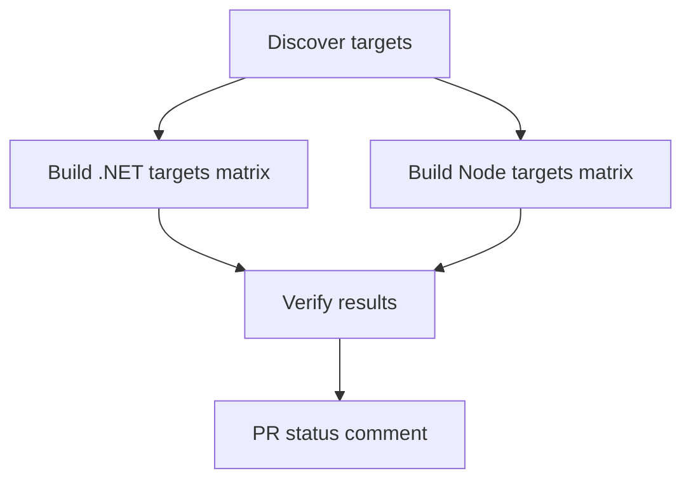
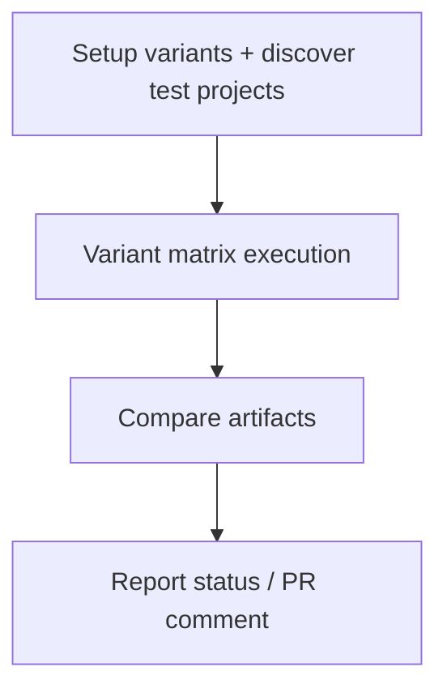

# Build Workflows Guide

This guide covers the two build-centric workflows:

- `.github/workflows/build-all-modules.yml`
- `.github/workflows/build-variant-test.yml`

## 1. `build-all-modules.yml`

### Purpose

Build and test repository-owned build targets discovered at runtime:

- `.sln` and `.slnx` solutions
- optional Node target(s) when enabled and present

### Trigger conditions

- Push: `main`, `develop`, `feature/**` (docs-only changes ignored)
- Pull request: `main`, `develop`
- Manual: `workflow_dispatch`

### Manual inputs

| Input | Default | Effect |
| --- | --- | --- |
| `clean_build` | `false` | Disables dependency cache reuse |
| `include_node_targets` | `true` | Enables optional Node target builds |

### Execution flow



### Expected outputs

- `dotnet-results-*` artifacts with TRX test logs
- `node-results-*` artifacts with dist/build/coverage where available
- run summary with target discovery and pass/fail status

## 2. `build-variant-test.yml`

### Purpose

Run variant-oriented test coverage across supported operating systems.

### Variants

| Variant | Build config | `DOTNET_ENVIRONMENT` |
| --- | --- | --- |
| `development` | `Debug` | `Development` |
| `staging` | `Release` | `Staging` |
| `production` | `Release` | `Production` |
| `test` | `Release` | `Test` |

### Platforms

- `ubuntu-latest`
- `windows-latest`

### Trigger conditions

- Push: `main`, `develop` when source/test paths change
- Pull request: `main`, `develop`
- Manual: `workflow_dispatch`

### Manual inputs

| Input | Default | Effect |
| --- | --- | --- |
| `variants` | `all` | Comma-separated subset (`development,test`, etc.) |

### Execution flow



### Expected outputs

- `variant-<variant>-<os>` artifact bundles
- TRX test logs per variant/platform combination
- run summary with collected result-file counts by variant

## Local developer checks

Before opening a PR with workflow changes:

```bash
# Validate workflow structure using repository utility
python scripts/control/validate_workflows.py

# Optional: verify submodule integrity contract used by build/sync surfaces
python scripts/validate_submodule_integrity.py \
  --gitmodules .gitmodules \
  --repositories config/integrations/repositories.json
```

## Troubleshooting

- **No .NET targets discovered**
  - Confirm `.sln`/`.slnx` files exist and are not under excluded directories.

- **Variant tests are skipped**
  - Confirm test projects follow `*Tests*.csproj` naming and reside under `tests/`, `src/`, or `monado/`.

- **Node target stage not running**
  - Confirm `include_node_targets=true` and `plugins/openai/helios-mcp/package.json` exists.
