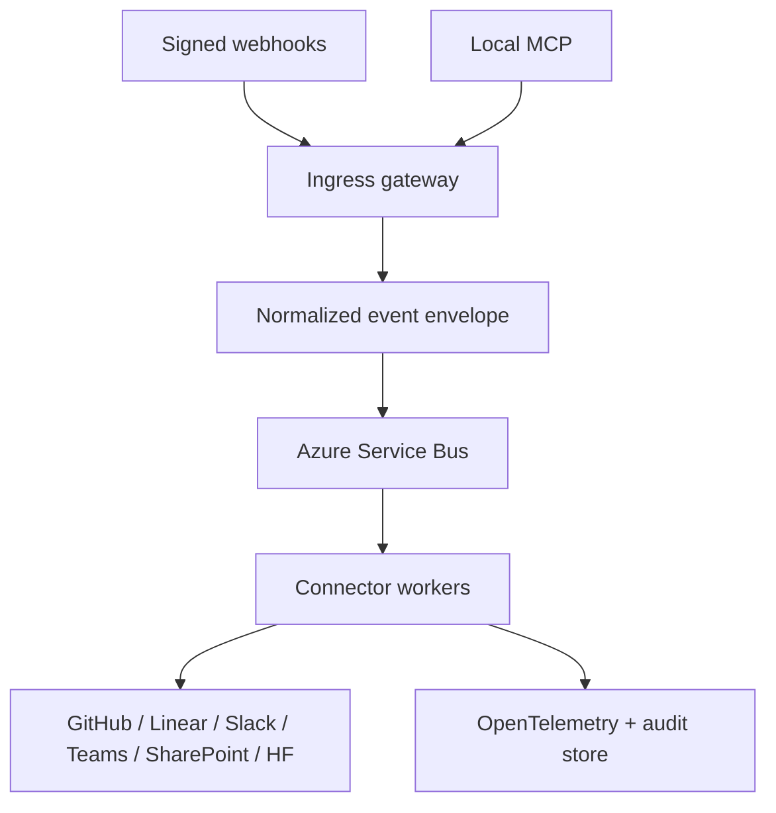

# Helios Connect architecture

## North star

One secure nervous system connects Helios engineering, planning, communication,
documents, and models without making any SaaS product the master of all state.
The diagram is the target architecture. Today only signed ingress, normalized
event creation, read-only MCP inventory, Container Apps, an empty Key Vault, and
Azure monitoring are implemented; Service Bus, workers, outbound writers,
durable idempotency, and the audit/dead-letter stores are not.

## System spine

- GitHub owns code, CI, releases, and deployment manifests.
- Linear owns planned work and delivery status.
- SharePoint owns human-facing governed documents.
- Microsoft Foundry Agent Service hosts governed Hermes/XCore agents, evaluations, tools, memory, and stable endpoints; Microsoft 365 Copilot and Teams are distribution surfaces.
- Slack and Teams are notification and interaction surfaces, never source-of-truth stores.
- Azure currently provides managed identity, an empty Key Vault, Container Apps,
  and monitoring for this slice. Service Bus and Storage are target services.
- Local MCP exposes two development-only status tools. The remote MCP exposes
  three read-only Azure inventory tools; the two surfaces are intentionally not
  interchangeable.

## Enterprise and multi-repository plane

- `Yolkster64/monado-blade` contains the C# engine and remains an independently
  releasable product repository.
- `M0nado/helios-platform` is the deployment repository of record for the
  `monado/helios-control` integration gateway, installer, GUI, Phase10, and
  platform deployment work.
- A command-center/orchestrator repository coordinates product repositories through versioned contracts; product repositories remain independently buildable and releasable.
- GitHub Enterprise is the primary code and pull-request surface. Azure DevOps is a bridged enterprise delivery surface for Boards, Pipelines, Artifacts, environments, and regulated approvals—not a competing source of truth.
- GitHub Actions and Azure Pipelines authenticate to Azure through Entra workload identity federation/OIDC. Long-lived PATs are migration-only and live in Key Vault when unavoidable.
- GitHub Copilot, Codex, Microsoft 365 Copilot, Copilot Studio, Azure AI Foundry, Azure OpenAI, and local providers connect through AIHub provider contracts and permission tiers rather than receiving unrestricted repository or tenant access.
- In the target enterprise plane, Azure API Management fronts enterprise APIs,
  Container Apps/AKS host services, ACR stores images, and Cosmos DB/Data Lake
  hold learning and event data. The current slice implements Container Apps,
  external ACR binding, Application Insights, and Log Analytics only.
- Entra groups, Conditional Access, managed devices, Purview classification, retention, audit, and selected-site Microsoft Graph permissions form the business governance edge.

### Agent permission tiers

| Tier | Capability | Default control |
| --- | --- | --- |
| 0 | Read public metadata | Automatic |
| 1 | Read approved private context | Audited allowlist |
| 2 | Draft code, issues, documents, and messages | Human review |
| 3 | Create branches, PRs, test runs, and staged deployments | Policy gates |
| 4 | Production, tenant, security, or destructive changes | Explicit approval and break-glass controls |

Agents prefer pull requests over direct pushes. No raw Bitwarden exports, recovery keys, access tokens, or production secrets enter repositories, messages, model artifacts, or logs.

## Contracts

Every event has `id`, `type`, `source`, `subject`, `occurredAt`, `correlationId`,
`traceParent`, `dataClassification`, and `payload`. Future workers must be
idempotent on `id + target`, and future outbound operations must carry a Helios
correlation marker. No outbound worker is implemented today.

## Security boundaries

1. Verify provider signatures before parsing payloads.
2. Store secrets only in Key Vault; use workload/managed identity in Azure.
3. Give each connector its own least-privilege identity and egress policy.
4. Separate read, draft, and live-write capabilities.
5. Redact credentials and personal data before logs or cross-system messages.
6. When durable routing is implemented, dead-letter failed events and never
   retry non-idempotent writes blindly. The current slice has no DLQ or replay
   tool.

## Delivery milestones

1. Foundation: envelope, validation, dry-run audit, local MCP.
2. Vertical slice: GitHub Actions failure -> Linear issue -> Slack/Teams notice.
3. Knowledge slice: SharePoint change -> indexed document reference; HF release -> governed model card.
4. Azure hardening: Key Vault, Service Bus, Container Apps, App Insights, private endpoints.
5. GUI: Monado status, route toggles, replay, approvals, and audit explorer.
6. Enterprise federation: Azure DevOps bridge, GitHub multi-repo release graph, Copilot/Foundry agent registry, Entra/Purview governance, and business continuity controls.
7. Hermes learning plane: weakness-aware task generation, sandbox execution, evaluation, human/policy approval, versioned promotion, and monitored rollback.
