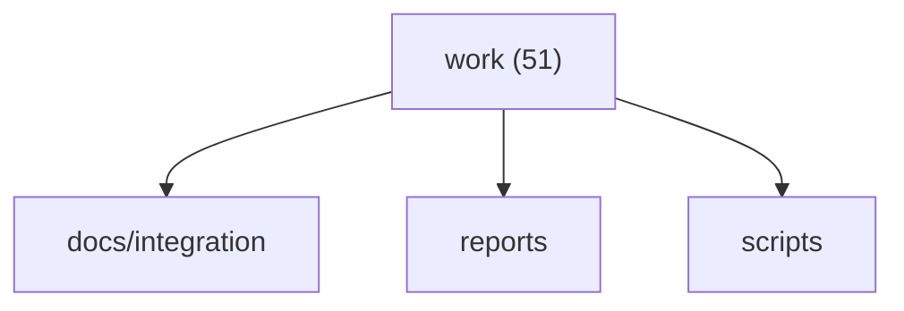
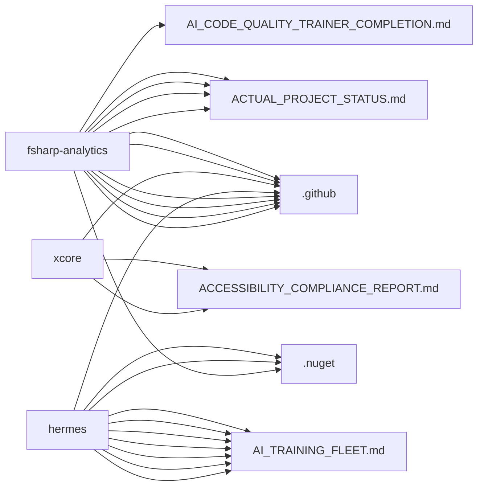

# Branch Intelligence Graphs

## Branch to module

```mermaid
graph TD
  work["work (51)"]
  work --> docs_integration["docs/integration"]
  work --> reports["reports"]
  work --> scripts["scripts"]
```

## Idea categories

```mermaid
graph LR
  fsharp_analytics["fsharp-analytics"] --> _github[".github"]
  fsharp_analytics["fsharp-analytics"] --> _github[".github"]
  xcore["xcore"] --> _github[".github"]
  hermes["hermes"] --> _github[".github"]
  fsharp_analytics["fsharp-analytics"] --> _github[".github"]
  fsharp_analytics["fsharp-analytics"] --> _github[".github"]
  fsharp_analytics["fsharp-analytics"] --> _github[".github"]
  fsharp_analytics["fsharp-analytics"] --> _github[".github"]
  hermes["hermes"] --> _nuget[".nuget"]
  hermes["hermes"] --> _nuget[".nuget"]
  fsharp_analytics["fsharp-analytics"] --> _nuget[".nuget"]
  xcore["xcore"] --> ACCESSIBILITY_COMPLIANCE_REPORT_md["ACCESSIBILITY_COMPLIANCE_REPORT.md"]
  xcore["xcore"] --> ACCESSIBILITY_COMPLIANCE_REPORT_md["ACCESSIBILITY_COMPLIANCE_REPORT.md"]
  fsharp_analytics["fsharp-analytics"] --> ACTUAL_PROJECT_STATUS_md["ACTUAL_PROJECT_STATUS.md"]
  fsharp_analytics["fsharp-analytics"] --> ACTUAL_PROJECT_STATUS_md["ACTUAL_PROJECT_STATUS.md"]
  fsharp_analytics["fsharp-analytics"] --> ACTUAL_PROJECT_STATUS_md["ACTUAL_PROJECT_STATUS.md"]
  fsharp_analytics["fsharp-analytics"] --> ACTUAL_PROJECT_STATUS_md["ACTUAL_PROJECT_STATUS.md"]
  fsharp_analytics["fsharp-analytics"] --> AI_CODE_QUALITY_TRAINER_COMPLETION_md["AI_CODE_QUALITY_TRAINER_COMPLETION.md"]
  hermes["hermes"] --> AI_TRAINING_FLEET_md["AI_TRAINING_FLEET.md"]
  hermes["hermes"] --> AI_TRAINING_FLEET_md["AI_TRAINING_FLEET.md"]
  hermes["hermes"] --> AI_TRAINING_FLEET_md["AI_TRAINING_FLEET.md"]
  hermes["hermes"] --> AI_TRAINING_FLEET_md["AI_TRAINING_FLEET.md"]
  hermes["hermes"] --> AI_TRAINING_FLEET_md["AI_TRAINING_FLEET.md"]
  hermes["hermes"] --> AI_TRAINING_FLEET_md["AI_TRAINING_FLEET.md"]
  hermes["hermes"] --> AI_TRAINING_FLEET_md["AI_TRAINING_FLEET.md"]
```

## Agent queue

```mermaid
graph TD
  Q1["extract-ideas 71"] --> M1["scripts"]
  Q2["extract-ideas 63"] --> M2["docs/integration"]
  Q3["extract-ideas 55"] --> M3["reports"]
  Q4["idea-review 23"] --> M4[".github"]
  Q5["idea-review 23"] --> M5[".github"]
  Q6["idea-review 23"] --> M6[".github"]
  Q7["idea-review 23"] --> M7[".github"]
  Q8["idea-review 23"] --> M8[".github"]
  Q9["idea-review 23"] --> M9[".github"]
  Q10["idea-review 23"] --> M10[".github"]
  Q11["idea-review 23"] --> M11[".github"]
  Q12["idea-review 23"] --> M12[".nuget"]
  Q13["idea-review 23"] --> M13[".nuget"]
  Q14["idea-review 23"] --> M14[".nuget"]
  Q15["idea-review 23"] --> M15["ACCESSIBILITY_COMPLIANCE_REPORT.md"]
  Q16["idea-review 23"] --> M16["ACCESSIBILITY_COMPLIANCE_REPORT.md"]
  Q17["idea-review 23"] --> M17["ACTUAL_PROJECT_STATUS.md"]
  Q18["idea-review 23"] --> M18["ACTUAL_PROJECT_STATUS.md"]
  Q19["idea-review 23"] --> M19["ACTUAL_PROJECT_STATUS.md"]
  Q20["idea-review 23"] --> M20["ACTUAL_PROJECT_STATUS.md"]
  Q21["idea-review 23"] --> M21["AI_CODE_QUALITY_TRAINER_COMPLETION.md"]
  Q22["idea-review 23"] --> M22["AI_TRAINING_FLEET.md"]
  Q23["idea-review 23"] --> M23["AI_TRAINING_FLEET.md"]
  Q24["idea-review 23"] --> M24["AI_TRAINING_FLEET.md"]
  Q25["idea-review 23"] --> M25["AI_TRAINING_FLEET.md"]
```
